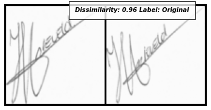
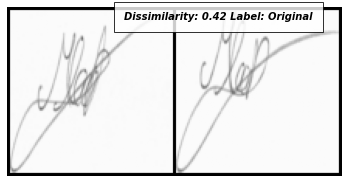

# SigNet Implementation in PyTorch (using SNN - Siamese Neural Network)
Interesting Paper that deals with Classifying the Signatures as `forged` or `original` using Siamese Network

Siamese Neural Network is a class of neural network architectures that has two or more identical sub networks. The Sub Netwoeks have same configuration with the same parameters and weights.

Parameter updating is mirrored across both sub networks.It is used find the similarity of the inputs by comparing its feature vectors.
*Triplet Loss* or *Euclidean Loss* can be used to find the distance between the feature vectors.

Here, Euclidean Distance is used for Pairwise Distance.

Paper Reference: https://arxiv.org/pdf/1707.02131.pdf

